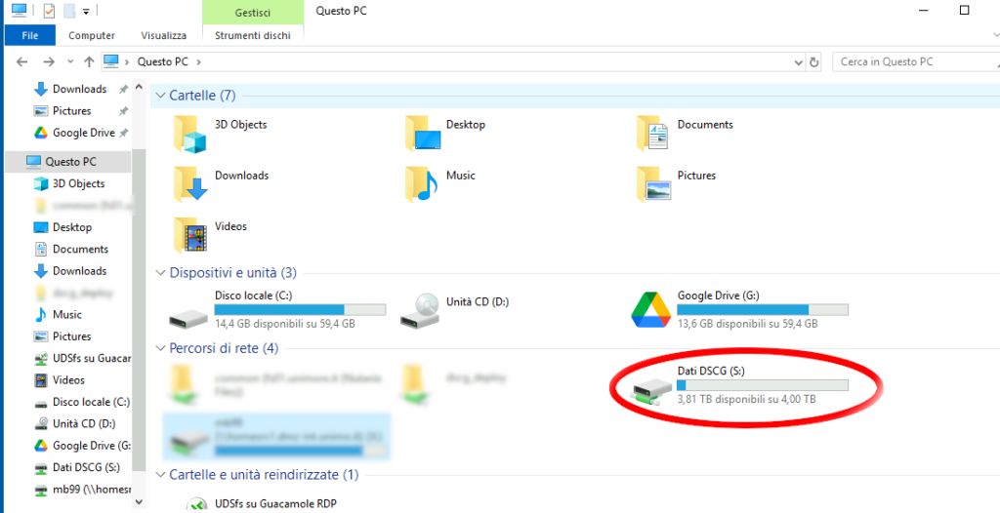
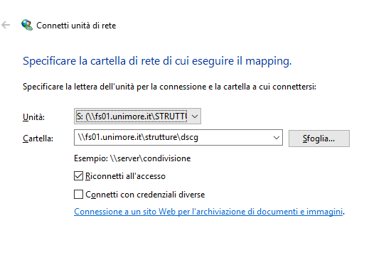

Il disco di rete Dati DSCG (s:) è uno spazio di archiviazione condiviso collocato sui server dei servizi informatici di Ateneo. Il disco contiene cartelle alle quali sono assegnati privilegi di accesso diversi in base ai ruoli del personale. È possibile accedere a questo disco di rete in vari modi, che variano a seconda della configurazione del PC, del sistema e della rete di accesso.

## PC Windows con autenticazione centralizzata

Nei PC Windows con autenticazione centralizzata (joinati al dominio unimore.it) il disco Dati DSCG (s:) è automaticamente visibile in *Questo PC*.



Qualora non fosse visibile è possibile forzare il collegamento aprendo il *Prompt dei comandi* e digitando il comando

```
gpupdate /force
```

## PC Windows senza autenticazione centralizzata o fuori dalla rete del DSCG

Sui PC Windows privi di autenticazione centralizzata (esempio PC personali non in dotazione unimore) o nelle macchine Windows che si trovano fuori dalla rete del DSCG (ad esempio i pc delle aule) è necessario montare il disco manualmente seguendo la procedura seguente.

- Se il PC si trova fuori dalla rete UNIMORE, attiva la VPN
- Clicca con il tasto destro del mouse su *Questo PC* e scegli *Connetti unità di rete*
- Nel campo relativo alla cartella digita il percorso di rete *\\fs01.unimore.it\strutture\dscg* Scegli una lettera dell’Unità da aggiungere a *Questo PC* (per coerenza puoi scegliere S:) e lascia la spunta su *Riconnetti all’accesso*
- Quando ti verranno richieste le credenziali, scrivi la username in questo modo: UNIMOREAD\mia-username seguita dalla password di posta



In caso di problemi di connessione o autenticazione che potrebbero verificarsi fuori dalla rete unimore è possibile montare il disco utilizzando il terminale.

Aprire il Prompt dei comandi e digitare il seguente comando sostituendo mia-username con la propria username personale

```
net use S: \\fs01.unimore.it\strutture\dscg /user:UNIMOREAD\mia-username
```

Dopo aver premuto invio digitare la password unimore

## PC GNU Linux o Mac OS

Su PC GNU Linux o Mac OS occorre connettersi alla condivisione pubblicata su *smb://fs01.unimore.it/strutture/dscg* Al momento della richiesta di credenziali la username è UNIMOREAD\mia-username seguita dalla password di posta. Qualora venisse richiesto username, dominio e password, nel campo dominio si può indicare UNIMOREAD e nel campo username la propria username senza prefisso.
