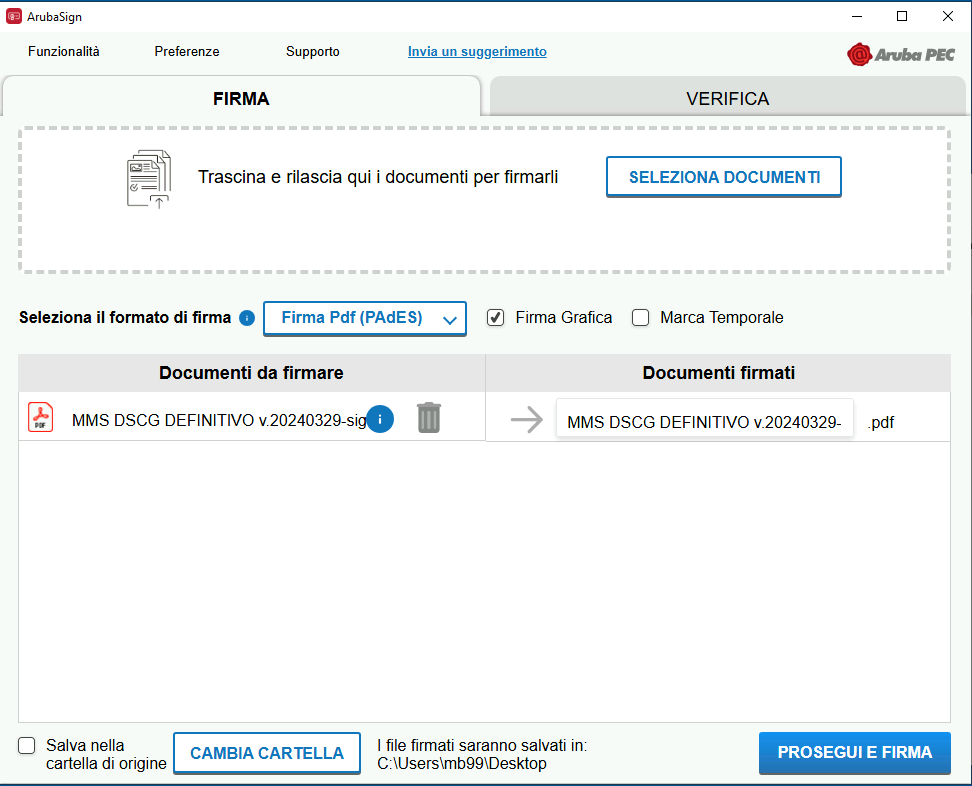
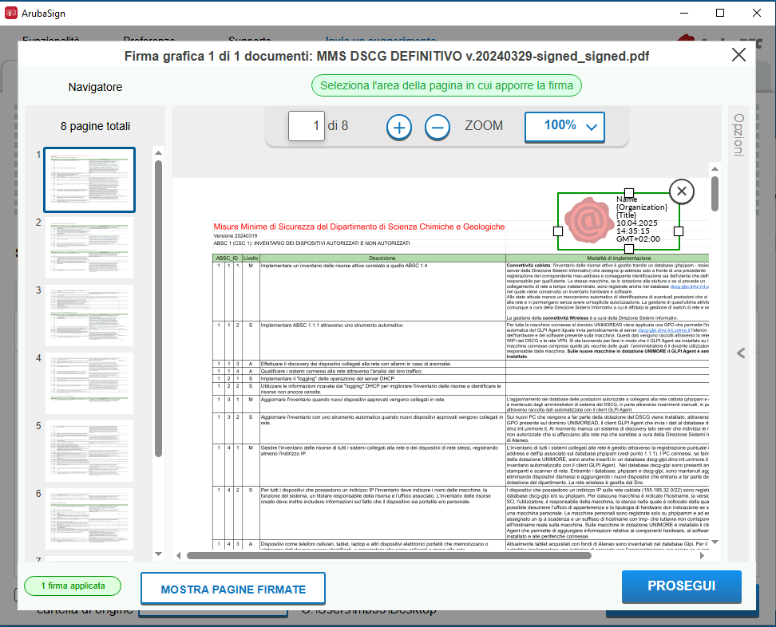
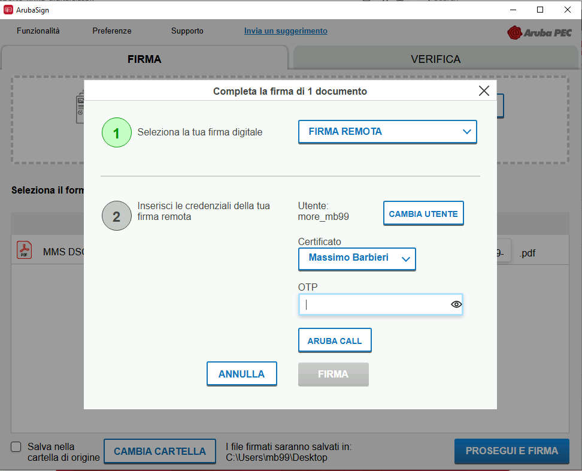

UNIMORE mette a disposizione di tutti i docenti una firma elettronica personale gestita con il servizio di firma remota ArubaSign offerto dal provider [Aruba](https://www.pec.it). Questa firma elettronica è necessaria per firmare i verbali d'esame su Esse3, ma può essere utilizzata anche per altri documenti digitali.

## Installazione

### Installare il software ArubaSign

 Puoi installare il sofware ArubaSign sul tuo PC senza disporre dei privilegi di amministratore.

1. Scarica l'ultima versione di ArubaSign compatibile con il tuo PC:
    - [Windows 64bit](https://updatesfirma.aruba.it/downloads/ArubaSign-latest(standard).msi)
    - [Apple](https://updatesfirma.aruba.it/downloads/ArubaSign-latest-OSX.dmg)

2. Fai doppio clic sul file scaricato e procedi all'installazione

### Utilizzare la versione online di ArubaSign

Se non puoi installare il software descritto sopra, Aruba mette a disposizione una versione online del software disponibile a [questo indirizzo](https://arubasign.arubapec.it).

# Utilizzo di ArubaSign

## Firmare i documenti

1. Apri il programma ArubaSign e attendi l'eventuale aggiornamento dei certificati
2. Seleziona la scheda *Firma* e trascina il documento da firmare in formato PDF (**Attenzione**: Se possibile, si raccomanda di usare il formato PADES. Questo formato supporta solo il formato PDF come file di input).
3. Scegli il formato *Firma PDF PADES* e attiva l'ozione *Firma Grafica* 
4. Trascina per formare un riquadro nel quale apporre la firma grafica 

5. Prosegui inserendo le tue credenziali e la verifica in due passaggi con il software Aruba OTP 

# Pagine utili
- [Pagina unimore dedicata alla firma elettronica](http://certificatidigitali.unimore.it/site/home/articolo113019406.html)

