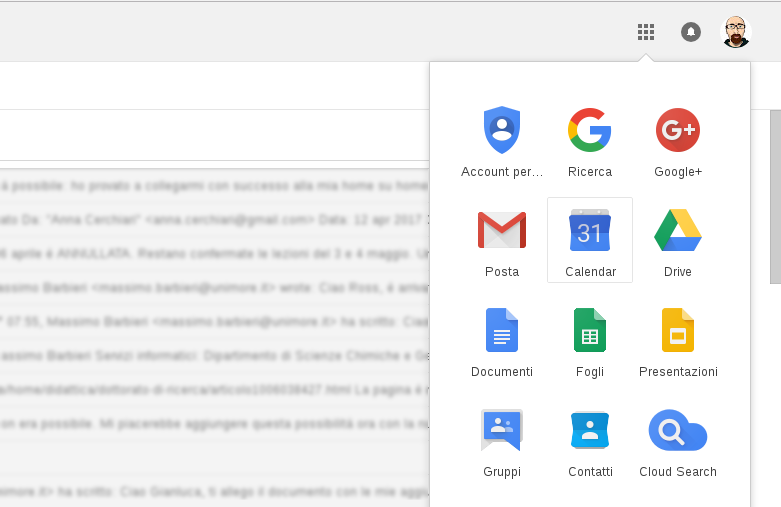
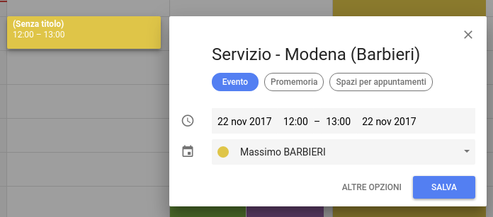
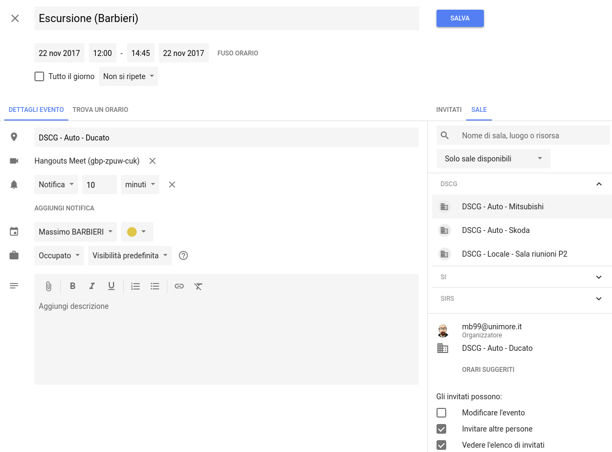
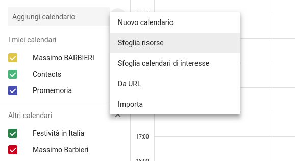
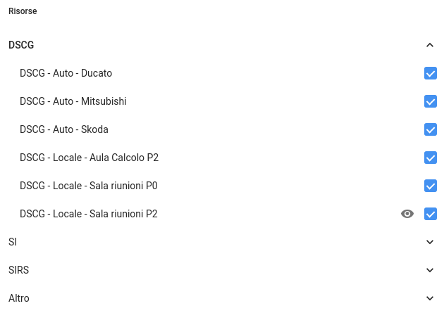
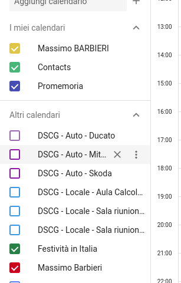


Se hai prenotato è utilizzato un automezzo del DSCG usa i link seguenti per compilare il **libretto di viaggio**:
- [Compila il libretto di viaggio di un’auto](https://goo.gl/forms/VNW21vP6lCTETKGr1)
- [Consulta il libretto di viaggio](https://drive.google.com/open?id=16biorarseGNvOPEsGT92tWB8rkXb7NpSH9cmR5yWbzI)


## Effettuare una prenotazione
Il sistema di prenotazione degli automezzi del Dipartimento di Scienze Chimiche e Geologiche si basa sul Calendario Google come il sistema di prenotazione delle sale riunioni.

1. Accedi alla tua casella di posta elettronica UNIMORE, premi il pulsante in alto a destra per accedere alle App di Google e scegli *Calendar*.

2. Sfoglia il calendario in modo da individuare il giorno nel quale desideri prenotare l’automezzo, clicca e trascina per creare la prenotazione nella fascia oraria che preferisci.

3. Assegna un nome alla prenotazione, es. Escursione (Barbieri) avendo cura di aggiungere fra parentesi il cognome della persona di riferimento della prenotazione, poi clicca sul pulsante *Modifica evento*.

4. Sulla destra scegli *Sale*. Naviga nel menu scegliendo DSCG e l’automezzo (o gli automezzi) che desideri prenotare. Il sistema mostra solo le auto disponibili nella fascia oraria scelta. Una volta effettuata la selezione premi il pulsante *Salva*. L’evento che hai creato sul tuo calendario sarà automaticamente condiviso sul calendario di prenotazione della sala che hai scelto.

## Cancellare una prenotazione
**Le prenotazioni dei mezzi dipartimentali possono essere modificate/cancellate SOLO ED ESCLUSIVAMENTE da chi fa la prenotazione**. Per cancellare la prenotazione di un automezzo è sufficiente cancellare l’evento sul proprio calendario personale.

## Visualizzare il calendario delle prenotazioni delle auto
È possibile aggiungere i calendari di prenotazione degli automezzi (o di altri locali del DSCG) sul proprio Google Calendar in modo da poter visualizzare rapidamente le prenotazioni già inserite.

Premi il pulsante con la **+** sulla sinistra, vicino alla voce Aggiungi calendario, e scegli Sfoglia risorse.

Entra dentro DSCG e spunta i calendari che desideri visualizzare, poi premi la freccia in alto a sinistra per tornare ai calendari.

Ora puoi disattivare la visualizzazione dei calendari del DSCG sulla sinistra e attivarli al bisogno.

