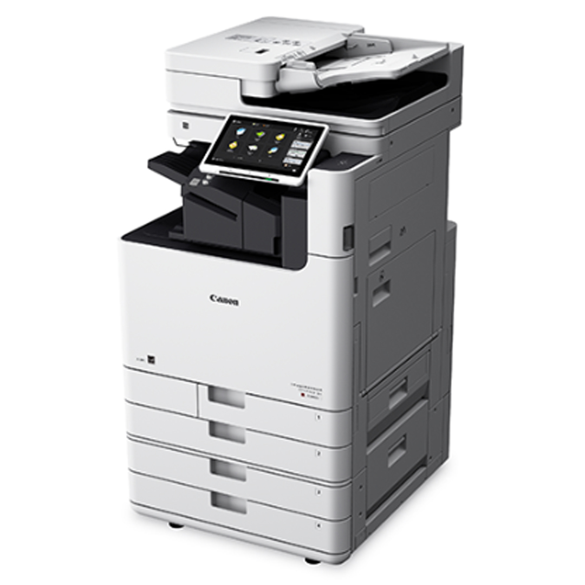
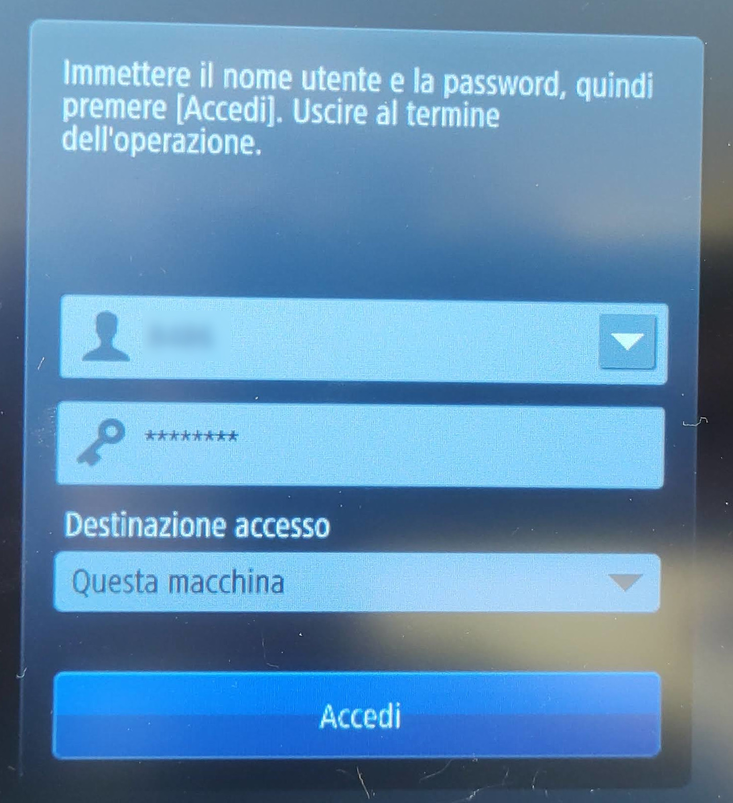

## Installazione delle fotocopiatrici come stampanti

### Prerequisiti

1. La fotocopiatrice che intendi installare deve essere accesa.
2. Per poter stampare devi essere connesso alla rete del dipartimento con il cavo (sulla rete wifi non è possibile stampare).
3. Devi essere in possesso di un PIN di stampa (se hai un ruolo non strutturato, prendi accordi con il tuo docente di riferimento che coprirà le spese di stampa e contatta gli amministratori di rete per avere un pin personale).

*Canon imageRUNNER ADVANCE DX C5850i*
| IP           | Modello                  | Locale                 |
| :---         | :---                     | :---                   |
|xxx.xxx.xx.1  | Canon ir-ADV DX C5850i   | Piano 0 – MO-51-00-066 |
|xxx.xxx.xx.2  | Canon ir-ADV DX C5850i   | Piano 1 – MO-51-01-057 |

### Installazione in ambiente Windows

1. Collegati al sito Canon, vai nella sezione *Supporto->Driver*, cerca la stampante indicando il modello *Canon imageRUNNER ADVANCED DX C5850* e scarica il driver compatibile con il tuo sistema operativo scegliendo il formato UFR. (Puoi usare anche questo [link diretto](https://www.canon.it/support/business/products/office-printers/imagerunner/advance-dx/imagerunner-advance-dx-c5850i.html))
2. Estrai il file facendo doppio click sull’eseguibile. Verrà creata una cartella con al suo interno i file di installazione del driver. Apri la cartella, entra nella cartella che contiene i file di installazione per sistemi a 64bit e avvia il *setup*.
3. Accetta i termini del contratto di licenza premendo *Sì*.
4. Scegli l’installazione standard e premi *Avanti*.
5. Seleziona la fotocopiatrice che desideri installare (vedi tabella riportata sopra). **Attenzione: finché saranno attive anche le vecchie fotocopiatrici, nella lista vedrai anche queste. Fai attenzione e selezione le nuove fotocopiatrici Canon ir-ADV DX C5850i**. Se non vedi la fotocopiatrice che desideri installare, assicurati che sia accesa e premi il pulsante *Aggiorna* per seguire una nuova scansione della rete.
6. Al termine della procedura di installazione riavvia il pc

### Installazione in ambiente MacOS (procedura non testata)

1. Scarica il driver compatibile con la tua versione di MacOS dal sito Canon e scegli il formato UFR
2. Installa il driver
3. Apri il pannello stampanti e aggiungi una nuova stampante
4. Scegli il tipo di stampante IP
5. Digita l’indirizzo IP della stampante (Puoi richiederlo agli amministratori di rete)
6. Scegli il protocollo di stampa LPD
7. Sostituisci il driver Generic PostScript con il driver installato precedentemente individuando il modello ImageRunner ADV C5850i
8. Aggiungi la stampante
9. Apri le proprietà del driver di stampa e abilita la gestione ID Dipartimento

## Eseguire una copia o una scansione
Per eseguire una copia o una scansione è necessario autenticarsi sulla fotocopiatrice con l'ID e il PIN fornito dagli amministratori di sistema successivamente premere il tasto *Accedi*.

Per ulteriori informazioni sull'uso della fotocopiatrice puoi consultare la [guida ufficiale](https://gdlp01.c-wss.com/gds/2/0300037772/01/iRADV_A3_DX_QOG_EU_multi.pdf).
