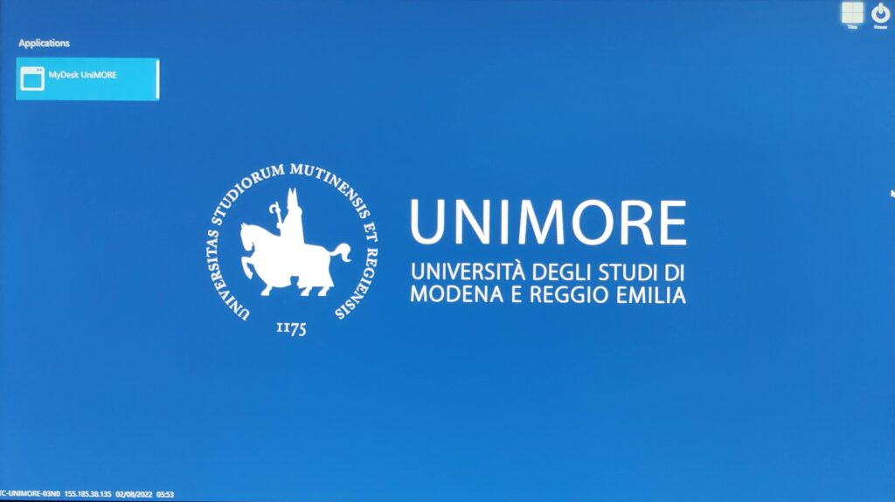
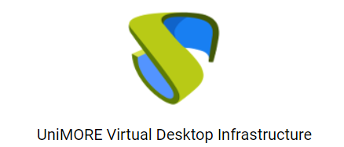

Le aule informatiche del Dipartimento di Scienze Chimiche e Geologiche sono state virtualizzate per avere una maggior flessibilità di utilizzo e per consentire agli studenti di poter accedere ai sistemi operativi anche da casa.

In aula troverai dei Terminal Client (TC), si tratta di semplici PC che hanno il compito di collegarti ai sistemi operativi virtualizzati (VM). Dopo aver effettuato il login con le tue credenziali UNIMORE, potrai scegliere quale sistema operativo virtualizzato avviare (Windows o GNU Linux). Anche da casa, con il tuo pc, potrai accedere ai medesimi sistemi.

## Puoi vedere solo le VM del tuo dipartimento
Questo sistema di virtualizzazione assegna le VM in base alla struttura di afferenza del tuo utente. Ad esempio, se sei uno studente di Scienze Chimiche, poiché il tuo corso di studio afferisce al Dipartimento di Scienze Chimiche e Geologiche (DSCG), vedrai le VM del DSCG.

Se sei uno studente che afferisce ad un altro dipartimento, ma hai necessità di accedere alle VM del DSCG, parla con il tuo insegnante e chiedi di inoltrare una richiesta ai refernti informatici del DSCG.

Se sei un docente che afferisce ad un dipartimento diverso dal DSCG e hai necessità di accedere alle VM del DSCG scrivi ai referenti informatici del DSCG.

## Quanti Terminal Client ci sono al DSCG?
Nelle DSCG abbiamo 24 TC nell'aula int-3 e 16 TC nel laboratorio di calcolo P2.

## Quante Virtual Machine abbiamo?


Se hai molti studenti in aula pianifica l'evento per fare avviare le VM per tempo! ...oppure usa GNU Linux.


Se non interviene una programmazione abbiamo a disposizione 40 VM GNU Linux e 25 VM Windows. Se interviene una programmazione le macchine Windows possono arrivare fino a 45.

Queste VM possono essere usate sia da utenti remoti che in aula, pertanto, se sei un docente e hai in programma una lezione o un ciclo di lezioni con molti studenti (>15) è opportuno pianificare l'evento per fare avviare per tempo le VM Windows necessarie (per GNU Linux il problema non si pone).

Se devi pianificare l'avvio delle VM scrivi a fausto.mellotti@unimore.it per programmare la lezione o il ciclo di lezioni indicando il numero di VM Windows che ti occorrono, quale aula userai, giorni e fascie orarie di utilizzo.

## Accedere alle VM da casa

### Accesso semplice in HTML5

Questa modalità di accesso permette di collegarsi alla macchina utilizzando il proprio browser. Si consiglia di utilizzare l’ultima versione di Google Chrome.

1. Collegati all’indirizzo https://mydesk.unimore.it
2. Scegli come autenticatore “Laboratori” e fai il login con le tue credenziali unimore.
3. Ti comparirà una schermata con i PC disponibili per i laboratori informatici del DSCG

### Accesso RDP

Questa modalità di accesso permette di collegarsi alla macchina virtuale attraverso un client dedicato. Il collegamento può risultare più stabile e con meno latenza, tuttavia è necessario installare e configurare alcuni software sul proprio pc.

*PREPARA IL PC PER COLLEGARTI VIA RDP*

1. Se non è già presente sul tuo PC installa Forticliet per collegarti alla rete VPN di unimore. Puoi trovare le istruzioni di configurazione e il software qui o sul sito https://vpn.unimore.it
2. Collegati all’indirizzo seguente https://mydesk.unimore.it scegli come autenticatore “laboratori” e fai il login con le tue credenziali unimore.
3. Clicca in alto a destra per scaricare il client UDS e installalo sul tuo PC. Dopo questo passaggio sei pronto per collegarti.

*COLLEGATI ALLE MACCHINE IN RDP*

1. Collegati alla vpn di unimore con forticlient
2. Collegati alla pagina https://mydesk.unimore.it scegli come autenticatore “laboratori” e fai il login con le tue credenziali unimore.
3. Clicca sul menu relativo alla macchina (icona con 3 linee) e scegli Connessioni > Direct rdp poi scegli conferma l’apertura del client UDS

## Dove posso salvare i miei dati?


I dati salvati in locale sulla VM saranno persi poco dopo la chiusura della sessione.


Le VM non sono persistenti, ovvero, dopo pochi minuti che la sessione è stata chiusa, vengono distrutte. Per salvare i tuoi dati puoi accedere a Google Drive, con la versione desktop per Windows e con la versione web per Linux e slavare i tuoi dati sul cloud.
