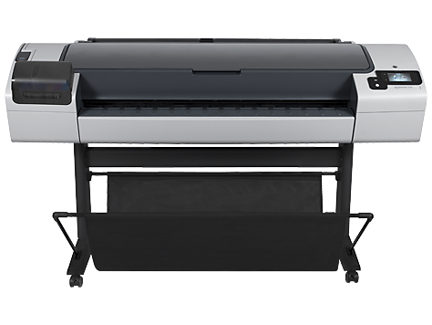
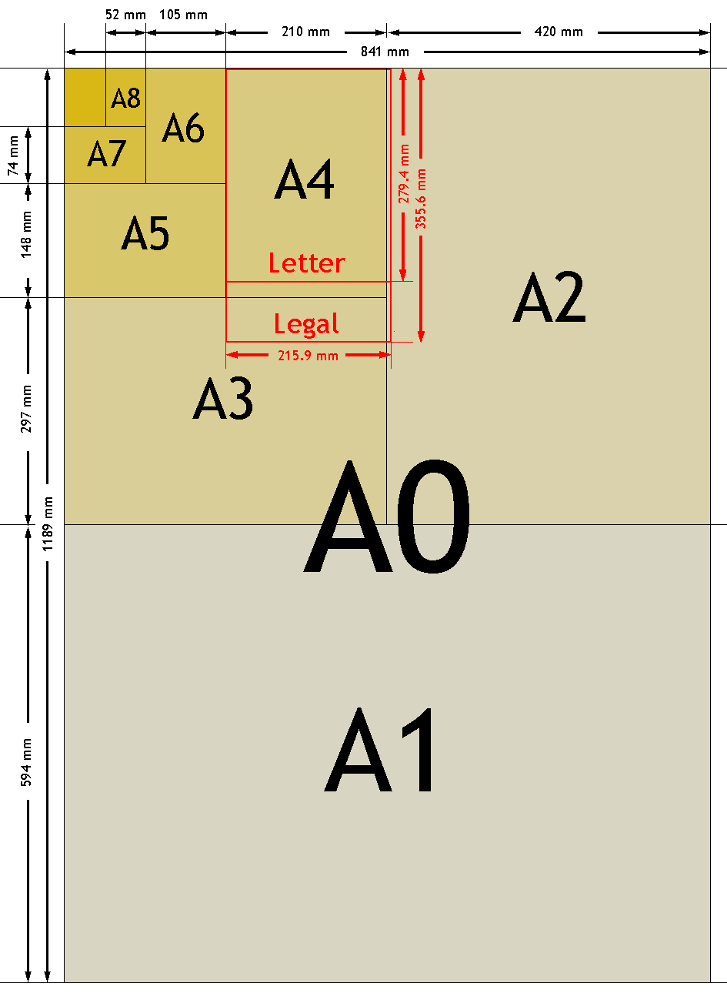

Il Dipartimento di Scienze Chimiche e Geologiche dispone di un plotter *HP Design Jet T795* che può essere utilizzato per effettuare stampe di documenti di grande formato quali poster, locandine o elaborati cartografici. Per effettuare una stampa è necessario **esportare il documento da stampare in formato PDF nelle dimensioni di stampa desiderate** e compilare il [modulo di richiesta stampe su plotter](https://docs.google.com/a/unimore.it/forms/d/e/1FAIpQLSf2byZOe-JIdIUbpH4XoZufbc1gaKKgMEbYhSRnw3a7EAh2eQ/viewform?usp=sf_link).

Il file di stampa deve essere inviato attraverso il modulo riportato sopra almeno **2 giorni lavorativi prima** del giorno di effettivo utilizzo della stampa (esclusi fine settimana o festività).

## Note importanti sul tipo di carta

Sono disponibili 2 tipologie di carta: comune e fotografica.

La carta comune è indicata per la maggior parte delle stampe quali poster, locandine ed elaborati cartografici. È estremamente economica, si può arrotolare o piegare facilmente e resiste bene al tempo.

La carta fotografica è indicata solo per usi molto particolari come locandine con fondo molto scuro o gigantografie che devono avere una resa qualitativamente molto alta. Ha un costo elevato e la superficie della carta è molto più delicata. Questa tipologia di carta non è adatta a poster o elaborati cartografici. (Al momento non disponibile).

## Note importanti sulla dimensione del documento

Prima di inviare il documento da stampare in formato PDF, controlla che il file prodotto sia nelle dimensioni di stampa corrette. Esempio se vuoi stampare un poster in formato A0 il documento pdf deve già essere in formato A0 ovvero 1189×841 millimetri.

## Ritiro del documento

Quando la stampa sarà pronta riceverai una email con le istruzioni per il ritiro presso il locale MO-51-01-004
