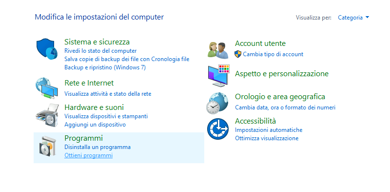

Attraverso il dominio Active Directory UNIMOREAD, il DSCG mette a disposizione una serie di software che può essere installato via rete senza richiedere i diritti di amministratore del PC.

Per ottenere questo software sono necessari alcuni requisiti:

1. Il PC deve essere connesso alla rete cablata del DSCG
2. Il PC deve essere legato al dominio UNIMOREAD e deve essere possibile accedere con le credenziali UNIMORE

## Elenco dei software disponibili

I software messi a disposizione con l'installazione via rete sono i seguenti:

| Software      | Version   |
| ------------- | -------   |
| 7-Zip         | 24.8      |
| Arubasign     | 24.1      |
| Google Chrome | 135.0     |
| Inkscape      | 1.4       |
| KeePass       | 2.57      |
| LibreOffice   | 24.8      |
| PDFsam        | 5.2       |
| QGis          | 3.34      |
| VLC           | 3.0       |

## Installazione del software

1. Dal menu Windows apri il Pannello di Controllo e, nella sezione *Programmi*, scegli *Ottieni programmi*. 
2. Si aprirà la lista dei software disponibili. Clicca con il tasto destro sul programma che desideri installare e scegli *Installa*.
